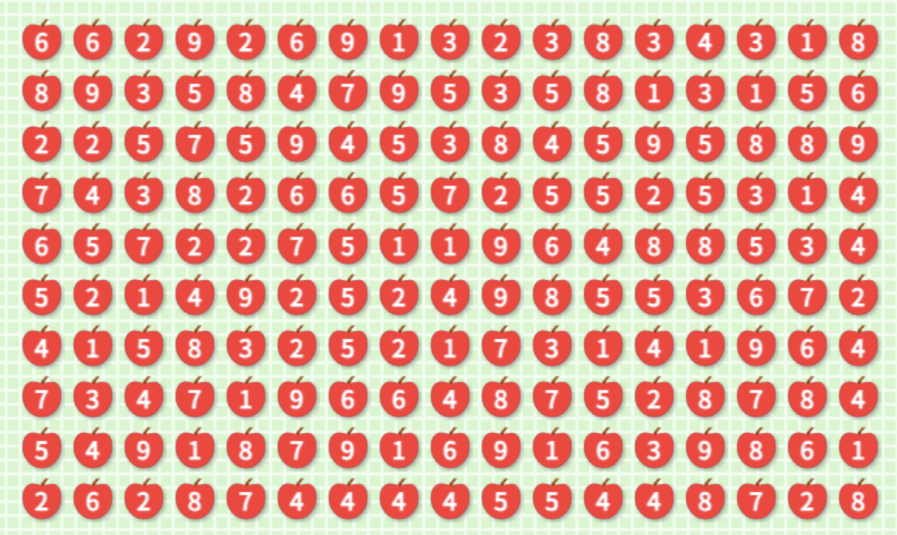

# AppleGamePathfinder

이 프로그램은 자동으로 사과 게임의 합이 10이 되는 숫자들을 시각화해서 선으로 보여주는 프로그램입니다.

## Description

이 프로젝트는 자동으로 사과 게임의 퍼즐 해답을 제공합니다. 이 프로그램은 숫자를 인식하고 탐지해 실시간으로 합이 10인 숫자들을 선으로 이어줍니다.

Python, OpenCV, PyAutoGUI가 사용되었습니다.

## Features

-   마우스를 드래그 해 사과 게임의 영역을 지정할 수 있습니다.
-   지정된 영역 내에서 사과 안의 숫자를 인식해 가로, 세로의 합이 10인 숫자들을 선으로 이어줍니다.
-   초록색 굵은 선으로 정답을 표시합니다

## Usage

1. 프로그램을 실행합니다.
2. 나오는 영역에서 예시와 같이 사과 게임의 테두리를 설정해줍니다.
   예시)
   
3. 인식된 테두리로 창이 새로 나옵니다. 그 창에서 이미지 숫자들을 이어주는 초록색 선이 나오는 것을 확인합니다(나오지 않을 경우, 사과 게임을 확대/축소 해서 이미지를 조정해줍니다)
4. 전부 사용했으면 'ESC' 키를 눌러 프로그램을 종료합니다.

## Installation

1. [AppleGamePathfinder](https://github.com/calm17ess/Projects/releases/tag/v1.0.0) 링크에서 [AppleGamePathfinder.exe](https://github.com/calm17ess/Projects/releases/download/v1.0.0/AppleGamePathfinder.exe)를 다운로드 받습니다.
